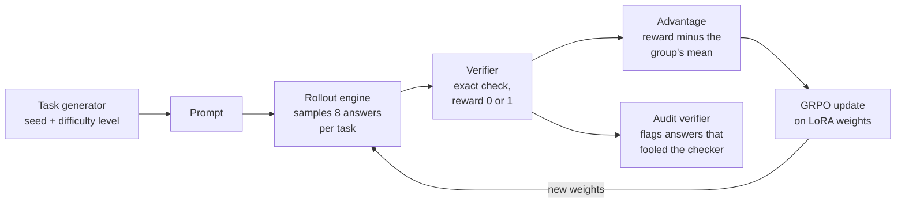

# Abhyasa

**RL post-training from scratch: verifiable environments, a hand-written GRPO trainer, and an
honest look at reward hacking.**


> **Status (September 2026): the design is complete and implementation is starting.** This README
> describes what is being built and how it will be measured. The [Results](#results) section fills
> in as experiments finish. Nothing is claimed as a result until it appears there with a
> confidence interval.

---

## What this is

Abhyasa trains a small open language model with **reinforcement learning from verifiable rewards
(RLVR)**, the technique behind DeepSeek-R1 and the reasoning models that followed. Every part of
the pipeline is written from first principles in PyTorch. There is no TRL, verl, OpenRLHF,
Unsloth or peft.

| Part | What it does | What makes it hard |
|---|---|---|
| **Environments** | Generate tasks and check answers exactly | If the checker can be fooled, the model learns to fool it |
| **Trainer** | Turns scored attempts into weight updates (REINFORCE, then GRPO, Dr. GRPO, DAPO) | Sparse, noisy rewards, 6 GB of GPU memory, and loss bugs that fail silently |
| **Rollout engine** | Generates the model's attempts, first with Hugging Face, then vLLM | Generation dominates RL time, and the engine's numbers must match the trainer's |
| **Evaluation** | Held-out dev and test tasks, several seeds, confidence intervals, controls | A lucky run and a real gain look identical without it |

The model is **Qwen2.5-0.5B-Instruct**, trained on a single **6 GB laptop GPU** (RTX 4050), with
Qwen2.5-1.5B-Instruct on free Kaggle GPUs for larger runs. No paid compute and no paid APIs.

## How it works



The model is its own data source: it attempts each task several times, a program grades every
attempt, and the update makes above-average attempts more likely. If all attempts at a task score
the same, that task teaches nothing, so choosing task difficulty is part of the algorithm.

## The environments

The tasks come from **Indian finance operations**, where answers can be checked to the paisa. All
of them are generated from a seed, so there is no dataset licence, the supply of tasks is
unlimited, and train and test sets are cleanly separated.

| Environment | The model must | Checked by | Turns |
|---|---|---|---|
| `gst_invoice` | Compute an invoice's taxable value, CGST, SGST or IGST, and total | Exact comparison in paise | 1 |
| `settlement_match` | Find which invoices a payment-gateway settlement paid, after the gateway's fee and the GST on that fee, or answer "ambiguous" or "no match" | The solver's full set of valid answers | 1 |
| `ledger_agent` | Reconcile a day's bank lines using lookup and matching tools | The final state of the ledger database | many |

### An example task from settlement_match

Open invoices: INV-101 ₹4,200.00, INV-102 ₹3,145.00, INV-103 ₹5,000.00, INV-104 ₹2,999.00,
INV-105 ₹7,145.00. The gateway charges a 2% fee plus 18% GST on the fee. The bank shows a credit of
**₹12,053.66**. Which invoices were paid?

**Answer:** INV-101, 102 and 103 (gross ₹12,345.00, fee ₹246.90, GST on the fee ₹44.44). The generator
also plants near misses, such as INV-101, 103 and 104, which gross ₹12,199.00.

Add INV-106 for ₹5,200.00 and INV-105 + INV-106 *also* gross ₹12,345.00. Now the only correct
answer is **"ambiguous"**. A checker that asks "does the claimed set close the payment?" would
accept a wrong answer here. Abhyasa's checker asks whether it is the *only* set that closes it.

### Design rules

- **Every rule is in the prompt** (tax rates, fees, rounding), so the reward measures computation,
  not memorized law.
- **Money is integer paise in code.** Never floats.
- **Every environment has a reference solver.** A test checks that the solver's answer scores 1 on
  10,000 seeds per difficulty level, which proves every task is solvable.
- **Uniqueness is proved, not assumed.** The solver finds *every* valid answer.
- **Five difficulty levels** per environment, so every metric can be split by difficulty.

## Reward hacking: defended and measured

RL optimizes the reward, not the intent. Any gap between "high reward" and "task solved" gets
found and widened. Abhyasa treats that as something to measure:

- **An attack catalog** that every verifier must survive. Two examples of real Python behaviour it
  covers: `int("१२३")` returns 123, and the regex `\d` matches Devanagari digits. Others: duplicate
  invoice IDs, several answer blocks, hedged answers, and truncated output.
- **An independent audit verifier**, written separately and stricter. Its disagreement rate with the
  training verifier is logged live as the *hack rate*.
- **Planted bugs.** A deliberately vulnerable verifier with three known bugs, used to measure how
  many training steps the policy takes to find and exploit each one.

## The trainer

Written by hand, lesson by lesson:

- **LoRA from scratch** on all seven linear layers of every block: 8,798,208 trainable parameters
  at rank 16 (1.78% of the model). Switching the adapters off gives back the original model, so the
  KL reference model costs no extra memory.
- **Memory-safe log-probs.** With a 151,936-token vocabulary, the fp32 logits for a single
  1,024-token sequence take 0.58 GiB. They are computed in checkpointed chunks instead.
- **Algorithms as config flags**, so every comparison is controlled:

| Variant | Advantage | Loss aggregation | Clip range | KL |
|---|---|---|---|---|
| REINFORCE + group baseline | r − mean | sum over tokens | none | none |
| GRPO | (r − mean) / std | mean per answer | 0.8 to 1.2 | β = 0.04 |
| Dr. GRPO | r − mean | sum / fixed constant | 0.8 to 1.2 | none |
| DAPO-lite | (r − mean) / std | mean over all tokens, dead groups resampled | 0.8 to 1.28 | none |

## How results will be measured

- **Decisions on a dev set, headline numbers on a test set** that is evaluated once per final
  configuration.
- **Three training seeds** per headline run, with paired bootstrap confidence intervals.
- **Controls:** a random-reward run and a format-only run, because Qwen2.5-family models are known
  to improve even under spurious rewards.
- **Format separated from skill:** the valid-format rate is reported apart from accuracy given a
  valid format.
- **Every experiment written down before it runs** (hypothesis, comparison, metric).

## Results

| ID | Experiment | Status |
|---|---|---|
| E0 | Difficulty calibration with the 0.5B and 1.5B models and two large API models | ⬜ pending |
| E1 | Trainer sanity check on GSM8K, with controls | ⬜ pending |
| E2 | Main result on settlement_match: GRPO vs Dr. GRPO vs DAPO-lite, 3 seeds | ⬜ pending |
| E3 | Binary vs partial-credit rewards | ⬜ pending |
| E4 | Time to exploit for three planted verifier bugs | ⬜ pending |
| E5 | Effect of the KL penalty (optional) | ⬜ pending |
| E6 | What specialization costs on GSM8K and IFEval | ⬜ pending |
| E7 | vLLM rollouts: speedup, training-inference mismatch, truncated importance sampling | ⬜ pending |
| E8 | Multi-turn tool use on ledger_agent | ⬜ pending |

## Roadmap

| Milestone | Lessons | What it delivers | Status |
|---|---|---|---|
| M0 Setup | L0 | Environment and first memory numbers | ⬜ |
| M1 Environments | L1 to L7 | Toy policy gradients, the environment contract, gst_invoice, settlement_match, attack catalog, API calibration | ⬜ |
| M2 Measure first | L8 to L10 | Rollout engine, eval harness with statistics, baselines | ⬜ |
| M3 Trainer | L11 to L17 | Log-probs, LoRA, REINFORCE, GRPO, training loop, GSM8K sanity run | ⬜ |
| M4 Own environments | L18 to L20 | Curriculum, main run, reward-hacking experiments (**v0.5**) | ⬜ |
| M5 Multi-turn | L21 to L22 | ledger_agent and multi-turn RL | ⬜ |
| M6 vLLM rollouts | L23 to L24 | Colocated vLLM, weight sync, mismatch and TIS | ⬜ |
| M7 Ship | L25 | Environments on the Prime Intellect Environments Hub, write-up (**v1.0**) | ⬜ |

The detailed plan, with the goal and acceptance test of every lesson, is in [plan.md](plan.md).

## Repository layout (planned)

```text
abhyasa/
├── abhyasa/
│   ├── envs/          # contract, parsing, money, the three environments, curriculum
│   ├── redteam/       # attack catalog, audit verifier
│   ├── rollout/       # engine interface, Hugging Face and vLLM engines, collector
│   ├── model/         # LoRA, memory-safe log-probs, policy
│   ├── algo/          # advantages, losses, one training step
│   ├── eval/          # dev/test harness, statistics
│   └── train.py
├── configs/           # one YAML per experiment
├── scripts/           # baselines, calibration, plots
├── tests/             # CPU tests run in CI; GPU tests are marked
└── docs/              # numbers, baselines, experiments, hacks
```

## Getting started

The code is being built lesson by lesson, and setup instructions arrive with L0. Planned
requirements:

- Linux or WSL2, with Python 3.12 managed by [uv](https://docs.astral.sh/uv/)
- An NVIDIA GPU with 6 GB or more for training. A CPU is enough for the environments and their tests.

```bash
git clone https://github.com/SakashSrivastava/abhyasa
```

## Documentation

- [architecture.md](architecture.md): what is built and why. RL from first principles, each
  environment in detail, reward hacking, the algorithm from REINFORCE to DAPO, the memory budget,
  evaluation methodology, and design decisions.
- [plan.md](plan.md): the build order. 26 lessons with acceptance tests, the experiments register,
  risks, and a progress tracker.

## Key references

- Shao et al., *DeepSeekMath* (GRPO). [arXiv:2402.03300](https://arxiv.org/abs/2402.03300)
- Liu et al., *Understanding R1-Zero-Like Training* (Dr. GRPO). [arXiv:2503.20783](https://arxiv.org/abs/2503.20783)
- Yu et al., *DAPO*. [arXiv:2503.14476](https://arxiv.org/abs/2503.14476)
- Thinking Machines Lab, *LoRA Without Regret*. [thinkingmachines.ai](https://thinkingmachines.ai/blog/lora/)
- Shao et al., *Spurious Rewards: Rethinking Training Signals in RLVR*. [arXiv:2506.10947](https://arxiv.org/abs/2506.10947)
- Yao et al., *Your Efficient RL Framework Secretly Brings You Off-Policy RL Training*. [Notion](https://fengyao.notion.site/off-policy-rl)
- Epoch AI, *An FAQ on Reinforcement Learning Environments*. [epoch.ai](https://epoch.ai/gradient-updates/state-of-rl-envs)

The full list is in [architecture.md](architecture.md#22-references).

## The name

*Abhyāsa* is Sanskrit for practice: in the Yoga Sutras, steady practice kept up over a long time.
That is what RL is. A model improves by attempting a task again and again against something that
tells it whether it got it right.

## License

[MIT](LICENSE). Authors are listed in [AUTHORS.md](AUTHORS.md).
