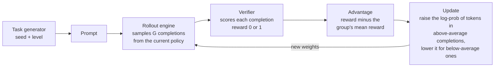
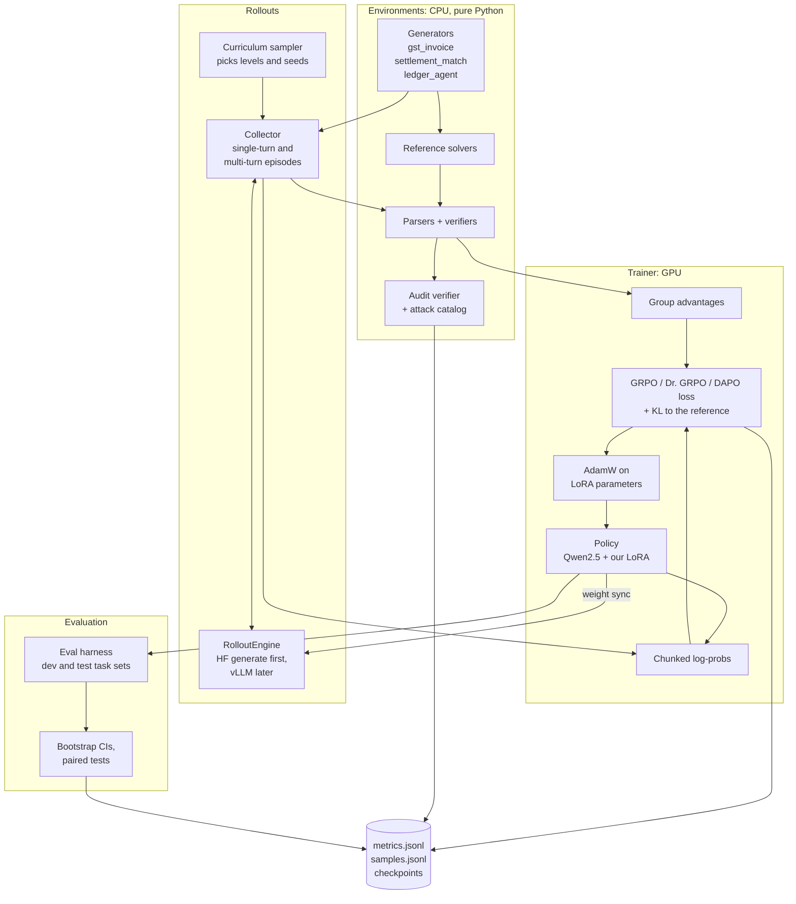
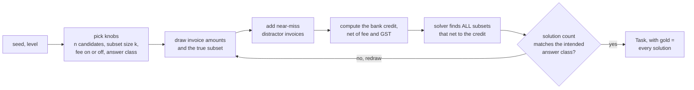
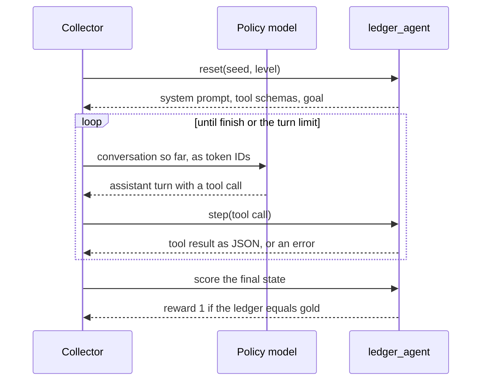
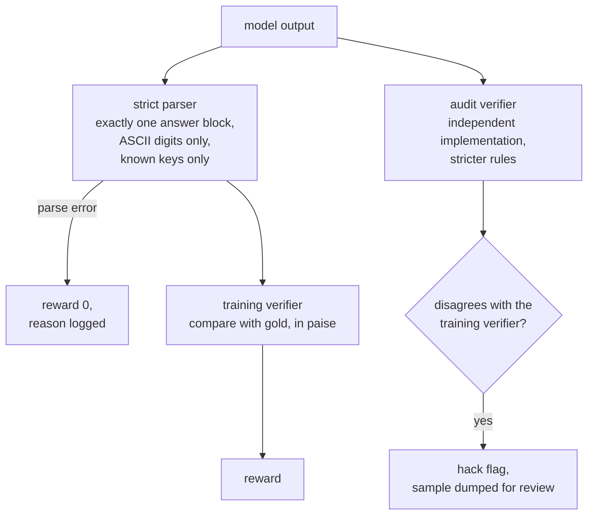
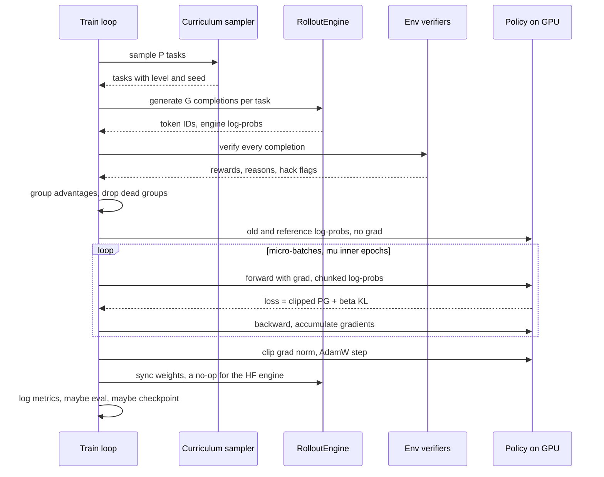
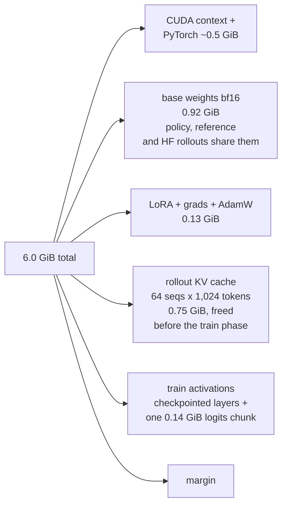
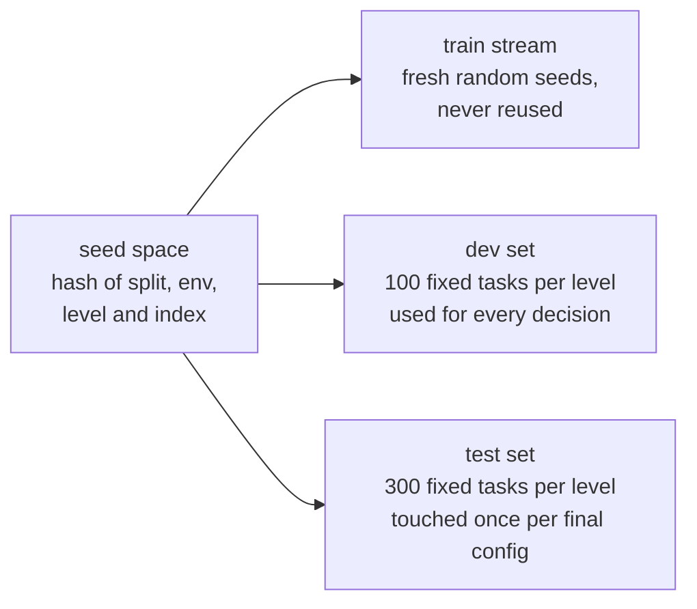
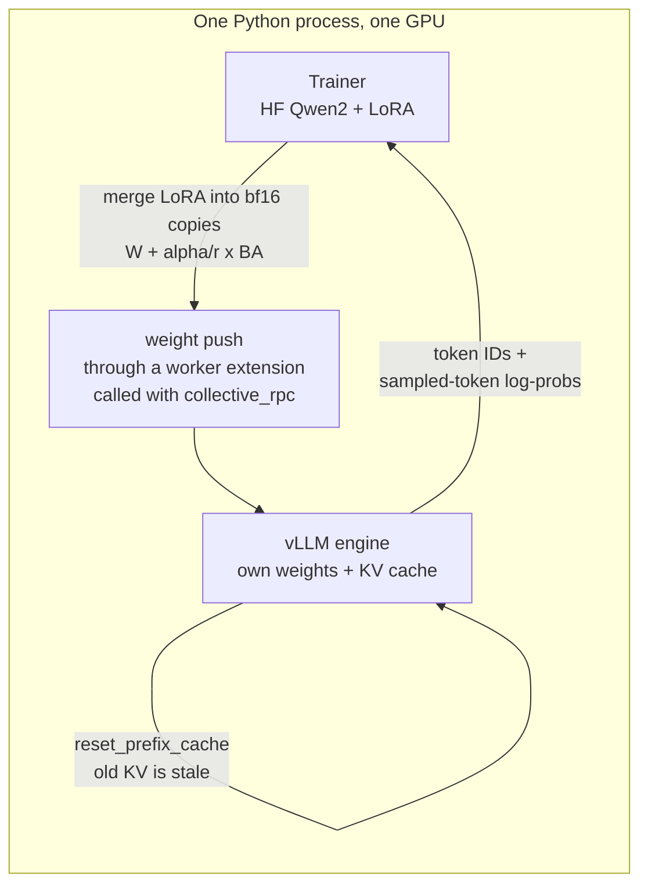

# Abhyasa: Architecture

**Abhyasa** is a reinforcement-learning (RL) post-training stack written from first principles:
verifiable environments, a GRPO trainer, and an evaluation harness. In its final form it
generates the model's attempts with vLLM, the way production RL frameworks do, and measures what
that costs in accuracy. It trains a small open model (Qwen2.5-0.5B-Instruct on the laptop,
Qwen2.5-1.5B-Instruct on Kaggle) to do Indian finance-operations tasks whose answers a program
can check exactly.

The name is Sanskrit *abhyāsa*, "practice". In the Yoga Sutras (1.12 to 1.14) it means steady
practice kept up over a long time, which is exactly what RL is: a model gets better by attempting
a task again and again against something that says whether it got it right. The name is free on
PyPI (checked 25 Sep 2026).

It is a learning and portfolio project. Every idea used by production RL frameworks (verl,
prime-rl, OpenRLHF, TRL) is implemented here in readable PyTorch, and every clever piece has a
slow, obviously-correct reference beside it that stays in the repo forever.

The build order lives in [plan.md](plan.md). This document explains **what** the system is,
**how** the parts fit together, and **why** each design choice was made.

> **How to read this.** Sections 1 and 2 need no background. Section 3 onward assumes you know
> roughly what a neural network and a gradient are. Every technical term is defined in the
> [Glossary](#21-glossary).

---

## Table of contents

1. [The problem in plain words](#1-the-problem-in-plain-words)
2. [How RL trains a language model](#2-how-rl-trains-a-language-model)
3. [System overview](#3-system-overview)
4. [Components and files](#4-components-and-files)
5. [Environments: the design rules](#5-environments-the-design-rules)
6. [Env 1: gst_invoice](#6-env-1-gst_invoice)
7. [Env 2: settlement_match](#7-env-2-settlement_match)
8. [Env 3: ledger_agent (multi-turn)](#8-env-3-ledger_agent-multi-turn)
9. [Verifiers, parsing and reward hacking](#9-verifiers-parsing-and-reward-hacking)
10. [Rollouts](#10-rollouts)
11. [The policy: LoRA and the free reference model](#11-the-policy-lora-and-the-free-reference-model)
12. [Log-probs and the 151,936-token vocabulary](#12-log-probs-and-the-151936-token-vocabulary)
13. [The algorithm: from REINFORCE to GRPO](#13-the-algorithm-from-reinforce-to-grpo)
14. [One training step](#14-one-training-step)
15. [Curriculum and difficulty calibration](#15-curriculum-and-difficulty-calibration)
16. [Memory and time budget](#16-memory-and-time-budget)
17. [Evaluation methodology](#17-evaluation-methodology)
18. [vLLM as the rollout engine](#18-vllm-as-the-rollout-engine)
19. [Publishing to the Environments Hub](#19-publishing-to-the-environments-hub)
20. [Design decisions and non-goals](#20-design-decisions-and-non-goals)
21. [Glossary](#21-glossary)
22. [References](#22-references)

---

## 1. The problem in plain words

A language model that has finished pretraining and instruction tuning can already attempt many
tasks, but it does them unreliably. **RL post-training** improves reliability on tasks where you
can *check the answer*: the model tries a task many times, a program grades every attempt, and
the model is nudged toward the attempts that scored well. This is called **RL with verifiable
rewards (RLVR)**, and it is how DeepSeek-R1 and the reasoning models that followed learned to
reason. Sarvam used the same recipe for Sarvam-M.

Three parts decide whether it works, and each is a part of this project:

| Part | What it is | Why it is hard | Sections |
|---|---|---|---|
| **Environment** | A generator of tasks plus a checker (the *verifier*) that scores an attempt | If the checker can be fooled, the model learns to fool it. This is *reward hacking* | 5 to 9 |
| **Trainer** | Turns scored attempts into weight updates (GRPO) | Rewards are noisy and sparse, memory is tight, and a small mistake in the loss silently stops learning | 10 to 15 |
| **Rollout engine** | Generates the attempts | Generation dominates RL time, and the engine's numbers must match the trainer's | 10, 18 |

A fourth part holds the other three together: **measurement** (section 17). RL results are noisy.
Without fixed held-out tasks, several training seeds and confidence intervals, a real gain and a
lucky run look identical.

**Why Indian finance operations.** Checking is exact (integer arithmetic in paise), the domain
has real demand (Epoch AI's interviews name enterprise workflows as the fastest-growing kind of
RL environment), and it contains a classic verifier trap. Confirming that "this set of invoices
closes the payment" is not the same as confirming that "*only* this set closes it", and a
verifier that confuses the two rewards wrong answers. This project is about building verifiers
that do not make that mistake.

## 2. How RL trains a language model

Vocabulary first. The **policy** is the model being trained. A **task** becomes a **prompt**. The
model's answer is a **completion** (also called a **rollout**). The verifier turns a completion into
a **reward**. We sample a **group** of G completions for the same task, and each completion's
**advantage** is how much better it scored than its group's average.



Four ideas carry the whole project:

1. **The model is its own data source.** The training data is the model's own attempts. Only the
   reward says which attempts were good.
2. **Advantage, not reward.** What matters is whether an attempt beat the model's *usual* attempt
   at the same task. Sampling a group of G attempts gives that baseline for free, with no second
   network.
3. **Dead groups teach nothing.** If all G attempts score the same (all right or all wrong), every
   advantage is zero and that task contributes no gradient. Keeping tasks at the right difficulty
   is therefore part of the algorithm, not a detail (section 15).
4. **Small steps, many times.** Each update moves the weights a little. Learning shows up over
   hundreds of steps, and must be measured on tasks the model never trained on.

In one sentence, the policy gradient says: *increase the log-probability of every token in a
completion, in proportion to how much better than average that completion was.*

$$\nabla_\theta J \approx \frac{1}{G}\sum_{i=1}^{G} A_i \sum_{t} \nabla_\theta \log \pi_\theta(o_{i,t} \mid q, o_{i,<t})$$

Section 13 builds this up step by step, from REINFORCE to GRPO.

---

## 3. System overview



The environments know nothing about PyTorch, so all of them run and are tested on a CPU. The
trainer knows nothing about invoices, so any environment that follows the contract in section 5
plugs in. The rollout engine is behind an interface, so Hugging Face `generate` and vLLM are
interchangeable.

## 4. Components and files

The repo lives in WSL at `~/abhyasa`: vLLM and Triton need Linux, and a Linux filesystem avoids
OneDrive file locks.

```text
abhyasa/
├── pyproject.toml
├── configs/                      # one YAML per experiment
├── abhyasa/
│   ├── config.py                 # dataclass configs, YAML loading
│   ├── envs/
│   │   ├── base.py               # Task, Score, Env protocol, registry
│   │   ├── contract.py           # the test suite every env must pass
│   │   ├── parsing.py            # strict answer extraction
│   │   ├── money.py              # paise arithmetic and rounding rules
│   │   ├── gst_invoice/          # generator, solver, verifier, prompt
│   │   ├── settlement_match/     # generator, solver, verifier, prompt
│   │   ├── ledger_agent/         # sandbox, tools, multi-turn env, verifier
│   │   ├── gsm8k.py              # external sanity-check env
│   │   └── curriculum.py         # level sampler
│   ├── redteam/
│   │   ├── attacks.py            # catalog of adversarial outputs
│   │   └── audit.py              # independent strict verifier, disagreement metric
│   ├── rollout/
│   │   ├── engine.py             # RolloutEngine protocol, SamplingParams, Completion
│   │   ├── hf_engine.py          # Hugging Face generate
│   │   ├── vllm_engine.py        # vLLM, in-process (M6)
│   │   └── collector.py          # runs episodes, builds token-level trajectories
│   ├── model/
│   │   ├── lora.py               # LoRALinear, inject, merge, save, load
│   │   ├── logprobs.py           # chunked, checkpointed token log-probs + entropy
│   │   └── policy.py             # load model, apply LoRA, reference-mode switch
│   ├── algo/
│   │   ├── advantages.py         # group baselines: mean, std-normalized, RLOO
│   │   ├── losses.py             # policy-gradient, PPO clip, k3 KL, aggregation, TIS
│   │   └── step.py               # one training step
│   ├── train.py                  # main loop, checkpoint and resume
│   ├── eval/
│   │   ├── harness.py            # dev/test sets, greedy and sampled pass@k
│   │   └── stats.py              # bootstrap, paired bootstrap, McNemar, pass@k estimator
│   └── logging.py                # JSONL metrics and sample dumps
├── integrations/verifiers/       # adapters that publish our envs to the Hub (M7)
├── scripts/                      # baselines, API calibration, memory probe, plots
├── tests/                        # CPU tests; GPU tests marked @pytest.mark.gpu
└── docs/                         # numbers.md, baselines.md, experiments.md, hacks.md
```

| Component | Responsibility | Built in |
|---|---|---|
| `envs/base.py`, `contract.py` | The environment contract and its universal tests | L2 |
| `envs/parsing.py`, `money.py` | Strict parsing and exact money arithmetic | L3 |
| `envs/gst_invoice/` | Env 1: compute an invoice | L4 |
| `envs/settlement_match/` | Env 2: which invoices does this settlement pay | L5 |
| `redteam/` | Attack catalog, audit verifier, planted-bug verifier | L6 |
| `rollout/` | Engine interface, HF engine, collector | L8, L21, L23 |
| `eval/` | Held-out sets, pass@k, confidence intervals | L9 |
| `model/logprobs.py` | Memory-safe token log-probs | L11 |
| `model/lora.py` | LoRA from scratch | L12 |
| `algo/` | Advantages and losses from REINFORCE to DAPO | L14, L15, L18 |
| `train.py` | Loop, logging, checkpoint and resume | L16 |
| `envs/ledger_agent/` | Env 3: multi-turn tool use | L21 |
| `rollout/vllm_engine.py` | vLLM as the rollout engine | L23, L24 |
| `integrations/verifiers/` | Publishing to the Environments Hub | L25 |

---

## 5. Environments: the design rules

An environment is a *program that generates tasks and grades answers*. Eight rules make ours
trustworthy.

1. **Procedural and seeded.** `generate(seed, level)` is a pure function. That gives unlimited
   tasks, no dataset licences, and a clean train/test split: train and eval use disjoint seed
   namespaces (section 17).
2. **Every rule is in the prompt.** Tax rates, fee percentages and rounding rules are stated in the
   task. The reward then measures *computation*, not memorized tax law. The rates follow the GST
   slabs in force since 22 September 2025 (5, 18 and 40 percent), but the prompt is the authority.
3. **Money is integer paise in code, always.** Never floats: `0.1 + 0.2 == 0.30000000000000004`.
   Rupee strings exist only at the edges, when rendering the prompt and parsing the answer.
4. **Every environment ships a reference solver.** A test runs the solver on 10,000 seeds and
   checks the verifier gives every solver answer a reward of 1. That proves two things at once:
   every task is solvable, and the verifier accepts correct answers.
5. **Uniqueness is proved, not assumed.** The solver enumerates *all* correct answers. The gold
   answer is that full set, so a task with two valid answers is detected instead of silently
   grading one of them wrong.
6. **Explicit difficulty levels L1 to L5.** Each level is a set of knobs (how many items, which
   complications). The level travels with the task, so every metric can be split by level.
7. **Binary reward by default.** Partial credit is run only as an experiment (E3 in plan.md),
   because partial credit is the easiest reward to hack.
8. **The verifier never trusts the model.** Strict parsing, explicit types, no `eval()`, and an
   attack catalog it must survive (section 9).

### The contract

```python
@dataclass(frozen=True)
class Task:
    env: str
    seed: int
    level: int
    messages: list[dict]      # chat messages: system rules + user task
    gold: Any                 # canonical answer set from the reference solver
    meta: dict                # the knobs used, for per-level metrics

@dataclass(frozen=True)
class Score:
    reward: float             # 0.0 or 1.0 by default
    parsed: bool              # did the output parse at all
    reason: str               # "ok", "parse_error", "wrong_total", ...

class Env(Protocol):
    name: str
    levels: range
    def generate(self, seed: int, level: int) -> Task: ...
    def solve(self, task: Task) -> Any: ...
    def verify(self, task: Task, completion: str) -> Score: ...
    def render(self, answer: Any) -> str: ...     # turns an answer into model-style text
```

The multi-turn environment adds `reset` and `step` (section 8).

### The contract test suite

Every environment must pass the same tests in `envs/contract.py` before any GPU time is spent on
it:

| Test | What it proves |
|---|---|
| Same seed and level give an identical task | Determinism, so runs are reproducible |
| `verify(task, render(solve(task)))` is 1 for 10,000 seeds | Every task is solvable, and correct answers are accepted |
| Empty and garbage completions score 0 with `parsed=False` | Parse failures are never rewarded |
| Every attack in the catalog scores 0 | The known hacks are closed (section 9) |
| The audit verifier agrees with the training verifier on solver answers | Two independent implementations agree |
| Dev and test seeds never collide with training tasks | No leakage (section 17) |

---

## 6. Env 1: gst_invoice

**Task:** compute an invoice's taxable value, taxes and total. This is the warm-up environment,
the one that proves the whole pipeline works before the harder one.

**Rules stated in the prompt:**
- The first two digits of a GSTIN are the state code (27 is Maharashtra, 29 is Karnataka).
- Seller and buyer in the same state: CGST and SGST, each at half the rate. Different states: IGST at the full rate.
- Tax is computed per line, each tax component rounded to the nearest paisa, halves rounded up, then summed.
- A table maps each item category to its rate (0, 5, 18 or 40 percent).

**Answer format:** reasoning, then exactly one JSON object inside `<answer></answer>` tags.

```json
{"taxable_value": "551.00", "cgst": "0.00", "sgst": "0.00", "igst": "74.35", "total": "625.35"}
```

Amounts are strings with exactly two decimals, so the parser can convert them to paise without
touching floats.

### Worked example (numbers verified by script)

Items: 3 LED bulbs at ₹120.00 (18 percent) and 2 kg of rice at ₹95.50 per kg (5 percent).
Taxable value = 360.00 + 191.00 = **₹551.00**.

| Case | Tax lines | Total |
|---|---|---|
| Inter-state (IGST) | 64.80 + 9.55 = 74.35 | **₹625.35** |
| Intra-state (CGST + SGST) | CGST 32.40 + 4.78 = 37.18, SGST the same | **₹625.36** |

The two totals differ by one paisa, because 2.5 percent of 191.00 is 4.775, which rounds up to 4.78
in *both* CGST and SGST. This is why rounding rules must be explicit and why the verifier works in
paise. It is also a good first test of whether the model follows stated rules exactly.

### Difficulty levels

| Level | Knobs |
|---|---|
| L1 | 1 line item, one rate |
| L2 | 2 or 3 items, mixed rates |
| L3 | 3 to 5 items, fractional quantities (kg), line discounts |
| L4 | 5 to 8 items, an invoice-level discount allocated across lines, with a stated rule for the leftover paisa |
| L5 | 8 to 12 items, exempt (0 percent) items, intra or inter-state decided from GSTINs only |

**Reward:** 1 if all five fields are exactly right, else 0. The partial-credit variant (fraction of
fields right) exists only for experiment E3.

---

## 7. Env 2: settlement_match

This is the core environment and the one the main results come from.

**Story.** A payment gateway collects several customer payments, then pays the merchant one lump
sum. Before paying out, it deducts its fee (a percentage of the gross, often called the MDR) and
18 percent GST on that fee. The merchant's bank statement shows only the net amount. Given that
amount and a list of open invoices, which invoices did this settlement pay?

**Answer format:** exactly one of these, inside `<answer></answer>`:

```json
{"invoice_ids": ["INV-101", "INV-102", "INV-103"]}
{"status": "ambiguous"}
{"status": "no_match"}
```

The gold answer is the set of *all* subsets that produce the bank credit, found by the solver:
zero subsets means `no_match`, exactly one means those IDs, two or more means `ambiguous`.

### Worked example (numbers verified by script)

Fee 2 percent of gross, GST 18 percent on the fee, each rounded to the nearest paisa, halves up.

| Invoice | Amount |
|---|---|
| INV-101 | ₹4,200.00 |
| INV-102 | ₹3,145.00 |
| INV-103 | ₹5,000.00 |
| INV-104 | ₹2,999.00 |
| INV-105 | ₹7,145.00 |

Bank credit: **₹12,053.66**.

The answer is INV-101, 102 and 103: gross ₹12,345.00, fee ₹246.90, GST on the fee ₹44.44, net
₹12,053.66. The enumeration confirms this is the only subset. The generator also plants near
misses: INV-103 and 105 gross ₹12,145.00, and INV-101, 103 and 104 gross ₹12,199.00.

Now add **INV-106 for ₹5,200.00**. INV-105 and 106 also gross exactly ₹12,345.00, so two different
subsets close the same credit, and the only correct answer is `{"status": "ambiguous"}`. A verifier
that only checks "does the claimed set close?" would reward either subset. Ours rewards neither,
because only the full solution set counts.

### The fee is not one-to-one

A useful shortcut for the model: net ≈ gross × (1 − 0.02 × 1.18) = gross × 0.9764, so the gross is
roughly the credit divided by 0.9764 (12,053.66 / 0.9764 = 12,345.00). But rounding makes the fee
function lumpy. Increasing the gross by one paisa can raise the net by one paisa, leave it
unchanged, or even *lower* it. Our script found that **44,840 gross amounts between ₹1,000 and
₹20,000 share their net amount with another gross amount**. Two consequences:

- The verifier never inverts the net. It computes the net of the claimed subset forward and
  compares.
- The solver first finds the handful of gross values whose net equals the credit (scan a small
  window around credit / 0.9764), then runs an exact subset-sum search for each.

### Generator pipeline



The solver is brute force up to 16 candidates (65,536 subsets) and meet-in-the-middle above that.
Both are tested against each other on small cases.

### Difficulty levels

| Level | Candidates | Subset size | Fee | Share of ambiguous / no_match |
|---|---|---|---|---|
| L1 | 3 | 1 | off (credit equals one invoice) | 0 / 0 |
| L2 | 5 | 2 | off | 0 / 0 |
| L3 | 6 to 8 | 2 or 3 | on | 5 / 5 percent |
| L4 | 8 to 12 | 3 or 4 | on, near-miss distractors | 15 / 15 percent |
| L5 | 12 to 16 | 4 or 5 | on, adversarial distractors | 20 / 20 percent |

**A built-in hack to watch for.** If 20 percent of L5 tasks are ambiguous, a policy that always
answers "ambiguous" scores 20 percent without reading anything. That is why the class shares stay
low, and why accuracy is always reported per answer class, not just overall.

---

## 8. Env 3: ledger_agent (multi-turn)

Single-turn tasks give the model everything at once. Real finance work means *looking things up*.
In this environment the model works through tools over several turns, in the style of τ-bench:
the outcome is judged by the final state of a database.

**Sandbox:** an in-memory ledger (Python `sqlite3` with `:memory:`) holding open invoices, the
day's bank lines, and settlement reports, all generated from the seed.

**Tools** (called with Qwen2.5's native `<tool_call>` JSON format):

| Tool | Returns or does |
|---|---|
| `list_bank_lines(date)` | the day's credits |
| `list_open_invoices(customer)` | open invoices, optionally for one customer |
| `get_settlement(batch_id)` | gross, fee, GST and payment IDs for a gateway batch |
| `match(bank_line_id, invoice_ids)` | records a match in the ledger |
| `flag(bank_line_id, reason)` | marks a line for human review |
| `finish()` | ends the episode |

**Goal:** reconcile every bank line of the day. **Reward:** 1 if the final ledger state equals the
gold state, else 0. Diagnostics (lines correct, invalid tool calls, turns used) are logged but are
not the reward.



### What gets trained: loss masks

Only tokens the model generated are trained. Everything the environment wrote is context.

| Segment | Written by | In the loss |
|---|---|---|
| System prompt, tool schemas, goal | environment | no |
| Assistant turn 1 (reasoning + tool call) | model | **yes** |
| Tool result 1 | environment | no |
| Assistant turn 2 | model | **yes** |
| ... | | |

**The re-tokenization trap.** Decoding the model's tokens to text and re-encoding the whole
conversation through the chat template can change token boundaries. The trainer would then
compute log-probs for tokens the model never sampled, which quietly turns the update into
nonsense. Rule: the collector keeps the exact sampled token IDs and builds each training sequence
by concatenating token-ID segments. Text is never re-tokenized. (The verifiers library solves the
same problem with its "renderers".)

**Honest expectation:** a 0.5B model will probably struggle here. The environment is calibrated
first with the 1.5B model on Kaggle and with large models through free APIs. It is a valuable
published artifact even if the smallest model barely learns it.

---

## 9. Verifiers, parsing and reward hacking

RL optimizes the reward, not your intent. Any gap between "high reward" and "task actually
solved" will eventually be found by the policy and widened. Epoch AI's interviews with people who
build RL environments for frontier labs put preventing this at the top of their list: high reward
must mean the task was solved. So the verifier gets defended in layers.



### The attack catalog

Each row is a test in `redteam/attacks.py`. Every attack must score 0.

| Attack | Example | Why it might slip through | Defense |
|---|---|---|---|
| Unicode digits | `"१२३.००"` | Python's `int("१२३")` returns 123, and regex `\d` matches Devanagari digits (verified) | Match `[0-9]` explicitly, never `\d` or bare `int()` |
| Underscore literals | `"1_000.00"` | `int("1_000")` returns 1000 | Strict regex `^[0-9]+\.[0-9]{2}$` |
| Several answer blocks | a wrong block, then a right one | "Take the first/last block" lets the model hedge | Exactly one `<answer>` block, or a parse error |
| Duplicate IDs | `["INV-101", "INV-101"]` | A set comparison dedupes silently, a sum counts twice | Reject duplicates explicitly |
| Everything | all invoice IDs | Checking "does it contain the answer" | Exact set equality |
| Hedged keys | `invoice_ids` *and* `status` | Lenient schema reads one key | Unknown or conflicting keys are a parse error |
| Status variants | `"Ambiguous "` | Loose string matching | Exact lowercase value, stated in the prompt |
| Answer in the reasoning | candidate answers in the thinking text | Parser scans the whole output | Parse only inside the final answer block |
| Length gaming | runs until the token limit | Truncated JSON that half-parses | Truncated output (finish reason "length") scores 0 |

### Planted bugs: measuring "time to exploit" (experiment E4)

The verifier has a `vulnerable=True` switch that plants three known bugs: duplicate IDs are
counted twice in the sum, the *first* answer block is used, and totals within ±₹1 are accepted.
We train on the vulnerable verifier and record how many steps the policy takes to discover each
bug, measured by the audit verifier's disagreement rate crossing 10 percent. Then we fix the
verifier and retrain. The write-up of this experiment ("what my verifier taught my model to cheat
at") is one of the project's main outputs.

---

## 10. Rollouts

```python
@dataclass
class SamplingParams:
    temperature: float = 1.0
    top_p: float = 1.0
    max_new_tokens: int = 512
    n: int = 8                         # group size G

@dataclass
class Completion:
    prompt_ids: list[int]
    token_ids: list[int]               # exactly what was sampled
    logprobs: list[float] | None       # the engine's own log-probs, if it reports them
    finish_reason: str                 # "stop" or "length"

class RolloutEngine(Protocol):
    def generate(self, prompts: list[list[int]], params: SamplingParams) -> list[list[Completion]]: ...
    def update_weights(self, named_tensors: Iterable[tuple[str, torch.Tensor]]) -> None: ...
    def reset_cache(self) -> None: ...
```

- **HFEngine** (M2) runs `transformers` generation on the *same* model object the trainer uses,
  with LoRA active and gradients off. Weight sync is free because there is nothing to sync.
  Its weakness is static batching: a batch waits for its longest completion. That is the
  head-of-line blocking that continuous batching removes.
- **VLLMEngine** (M6) is described in section 18.

**Sample at temperature 1.0 during training.** The policy gradient assumes samples come from π,
the policy being trained. Sampling at another temperature means sampling from a different
distribution than the one whose log-probs the loss uses. If training ever uses T ≠ 1, the trainer
must divide its logits by the same T. Evaluation uses greedy decoding (T = 0) for the headline
number, plus T = 1 samples for pass@k.

---

## 11. The policy: LoRA and the free reference model

**Qwen2.5-0.5B-Instruct:** 494,032,768 parameters, 24 decoder layers, hidden size 896, 14 query
heads sharing 2 key/value heads (head dimension 64), MLP size 4,864, vocabulary 151,936, tied
input and output embeddings. bf16 weights take 0.92 GiB.

**Why the Instruct model and not the base model.** It already follows answer formats, so early
training time goes into the task instead of into learning to emit JSON. TinyZero found that
Qwen2.5-0.5B *base* failed to learn its Countdown reasoning task at all.

### LoRA

Full fine-tuning would need fp32 master weights, gradients and two Adam moments for 494M
parameters, about 7.4 GiB before any activations. That does not fit in 6 GB. LoRA freezes every
original weight W and learns a small low-rank update beside it:

$$W' = W + \frac{\alpha}{r} B A, \qquad A \in \mathbb{R}^{r \times d_{in}},\ B \in \mathbb{R}^{d_{out} \times r}$$

B starts at zero, so at step 0 the LoRA model is *exactly* the original model (L12 tests this).
Thinking Machines' "LoRA Without Regret" found that for RL, LoRA matches full fine-tuning even at
rank 1, because a policy-gradient episode carries roughly one bit of information. Their advice,
which we follow: put LoRA on **all** linear layers, especially the MLP, and use a learning rate
about 10 times the full-fine-tuning one.

**Trainable parameters at rank 16** (you will check this by hand in L12):

| Matrix | Shape (in to out) | LoRA params, r = 16 |
|---|---|---|
| q_proj | 896 to 896 | 28,672 |
| k_proj | 896 to 128 | 16,384 |
| v_proj | 896 to 128 | 16,384 |
| o_proj | 896 to 896 | 28,672 |
| gate_proj | 896 to 4,864 | 92,160 |
| up_proj | 896 to 4,864 | 92,160 |
| down_proj | 4,864 to 896 | 92,160 |
| **Per layer** | | **366,592** |
| **All 24 layers** | | **8,798,208** (1.78 percent of the model) |

Rank 1 would be 549,888 parameters and rank 32 would be 17,596,416. At rank 16, fp32 parameters,
gradients and both Adam moments together take 134 MiB.

### The reference model costs nothing

GRPO's KL term compares the policy with the *reference* policy, the model before training. With
LoRA, switching the adapters off gives back exactly the original model. So the reference needs no
second copy in memory, only one extra forward pass per step:

| Mode | Adapters | Gradients | Used for |
|---|---|---|---|
| Policy | on | yes | the loss |
| Old policy | on | no | the PPO ratio when there are several inner updates (μ > 1) |
| Reference | **off** | no | the KL penalty |

---

## 12. Log-probs and the 151,936-token vocabulary

The loss needs, for every generated token, `log π(token | everything before it)`:

1. Run the model over prompt + completion. The logits at position t predict token t+1, so
   shift by one.
2. `log_softmax` over the vocabulary, then `gather` the entry of the token actually sampled.
3. Mask out prompt positions (and, in multi-turn, environment tokens).

**The memory problem.** The vocabulary is huge. The fp32 logits for one 1,024-token sequence are
151,936 × 1,024 × 4 bytes = **0.58 GiB**. A micro-batch of 4 sequences is 2.3 GiB of logits,
*before* backward keeps its own copy. That alone would exhaust the GPU.

**The fix (L11):** never materialize logits for the whole batch.

- Keep only the hidden states at completion positions.
- Process them in chunks of 256 rows: `lm_head`, then `log_softmax`, then `gather`, one chunk at a time.
- Wrap each chunk in `torch.utils.checkpoint`, so backward recomputes the chunk's logits instead of storing them.
- Peak logits memory drops to one chunk: 256 × 151,936 × 4 bytes = 0.14 GiB.

The same chunk also yields the **token entropy**, `logsumexp(z) − Σ softmax(z)·z`, which is the
main early warning of entropy collapse (section 14).

**Gradient checkpointing** on the 24 decoder layers does the same trick one level up: only each
layer's input is stored (24 × 1,024 × 896 × 2 bytes = 42 MiB per sequence), and the layer's
internals are recomputed during backward.

---

## 13. The algorithm: from REINFORCE to GRPO

The trainer is built in the same order you will learn it (plan L1, L14, L15, L18). Every variant
is a config flag in `algo/`, so each comparison is a controlled experiment.

### 13.1 REINFORCE

To raise the expected reward, push up the log-probability of each sampled completion in
proportion to its reward:

$$\nabla_\theta J = \mathbb{E}_{o \sim \pi_\theta}\left[ R(o) \, \nabla_\theta \log \pi_\theta(o) \right], \qquad \log \pi_\theta(o) = \sum_t \log \pi_\theta(o_t \mid o_{<t})$$

It is unbiased and extremely noisy. With 0/1 rewards, every correct completion gets pushed up by
the same amount whether the task was trivial or hard.

### 13.2 Baselines and groups

Subtracting a baseline b that does not depend on the sampled completion keeps the gradient
unbiased and cuts its variance: use R − b instead of R. The best cheap baseline is "how well does
the model usually do on *this* task", estimated from a group of G samples of the same prompt.

- **Group mean:** A_i = r_i − mean(r).
- **RLOO** (leave-one-out) uses the mean of the *other* G − 1 samples. A line of algebra shows
  r_i − b_i = G/(G − 1) × (r_i − mean(r)). The group mean is RLOO up to a constant factor.

No value network (critic) is needed. PPO's critic is a second model about the policy's size,
which is a big part of why this family of methods fits on one small GPU.

### 13.3 GRPO

DeepSeekMath's Group Relative Policy Optimization adds three things: advantages normalized by the
group's standard deviation, PPO's clipped ratio, and a KL penalty toward the reference model.

$$\mathcal{J} = \frac{1}{G}\sum_{i=1}^{G}\frac{1}{|o_i|}\sum_{t=1}^{|o_i|}\Big[\min\big(\rho_{i,t}\hat A_i,\ \mathrm{clip}(\rho_{i,t}, 1-\epsilon, 1+\epsilon)\,\hat A_i\big) - \beta\, \mathbb{D}_{KL}\Big]$$

- Ratio: ρ = π_θ(token) / π_old(token), the new policy's probability over the one that sampled it.
- Advantage: Â_i = (r_i − mean(r)) / std(r).
- Clipping stops a single update from moving any token's probability too far (ε = 0.2).
- KL uses the **k3 estimator**, per token: π_ref/π_θ − log(π_ref/π_θ) − 1. It is always ≥ 0 and
  cheap to compute from log-probs we already have.

**The on-policy subtlety.** With one update per batch (μ = 1), the "old" policy *is* the current
policy, so ρ = 1 exactly, clipping never triggers, and GRPO reduces to REINFORCE with a group
baseline plus KL. The ratio starts to matter with μ > 1, or when the rollout engine's numbers
differ from the trainer's (section 18). L15's unit tests check ρ = 1 at the first inner step.

### 13.4 Dr. GRPO: two biases in the normalizations

"Understanding R1-Zero-Like Training" (Liu et al., 2025) found two biases:

- **Dividing by the completion length |o_i|.** The penalty on a *wrong* answer is spread across
  its tokens, so a long wrong answer is punished less per token than a short one. Over training,
  wrong answers get longer.
- **Dividing by std(r).** Tasks that are almost always solved or almost always failed have a tiny
  std, so their advantages get blown up. The model over-weights the easiest and hardest tasks.

Dr. GRPO removes both: A_i = r_i − mean(r), and token sums are divided by a fixed constant (the
generation budget) instead of each completion's own length.

### 13.5 DAPO: four practical fixes

From ByteDance Seed's DAPO (2025):

- **Clip-higher:** asymmetric clipping, ε_low = 0.2 and ε_high = 0.28. Letting unlikely tokens gain
  probability faster fights entropy collapse.
- **Dynamic sampling:** drop groups whose rewards are all equal (dead groups) and sample more tasks
  to refill the batch, so every batch has full gradient signal.
- **Token-level loss:** average over *all* tokens in the batch, so long completions are not
  under-weighted.
- **Overlong handling:** completions cut off by the token limit are masked or given a soft length
  penalty, instead of a noisy 0.

### 13.6 The variants side by side

| Variant | Advantage | Loss aggregation | Clip range | KL | Dead groups |
|---|---|---|---|---|---|
| REINFORCE + group baseline (L14) | r − mean | sum over tokens | none | none | kept |
| GRPO (L15) | (r − mean) / std | mean per completion, then mean | 0.8 to 1.2 | β × k3, β = 0.04 | kept |
| Dr. GRPO (L15) | r − mean | sum / fixed constant | 0.8 to 1.2 | β = 0 | kept |
| DAPO-lite (L18) | (r − mean) / std | mean over all tokens in the batch | 0.8 to 1.28 | none | dropped and refilled |

---

## 14. One training step



Starting defaults (tuned in L16 and L17): P = 8 tasks × G = 8 completions = 64 completions per
step, 512 new tokens max, ε = 0.2, μ = 1, gradient-norm clip 1.0, LoRA rank 16, α = 32, learning
rate from a short sweep over 1e-5 to 1e-4.

### What to log every step

| Metric | Healthy | Warning sign |
|---|---|---|
| Mean reward, split by level | rises slowly on train levels | rises while the audit disagreement rate rises too: hacking |
| Dead-group fraction | below about 50 percent | above 60 percent: tasks too easy or too hard for the current policy |
| Token entropy | falls slowly | crashes toward 0 early: entropy collapse (raise ε_high, lower the LR) |
| Completion length (mean, p95, truncation rate) | stable or moves with difficulty | grows with flat reward: length bias or rambling |
| KL to the reference | grows slowly | jumps: learning rate too high |
| Clip fraction | small | large: updates too big for the trust region |
| Gradient norm | stable | spikes or NaN |
| Parse-failure rate | falls fast in the first steps | stays high: prompt or format problem |
| Audit disagreement (hack rate) | about 0 | anything sustained: read the samples |
| Step time split: rollout / verify / train | rollout largest | any surprise |

**Read samples, not just curves.** Every N steps the loop dumps the highest-reward, lowest-reward
and flagged completions to `samples.jsonl`. A rising reward curve with no samples read is not a
result.

---

## 15. Curriculum and difficulty calibration

With 0/1 rewards and pass rate p, a group of G samples is dead (all equal) with probability
p^G + (1 − p)^G:

| Pass rate p | Dead groups, G = 4 | G = 8 | G = 16 |
|---|---|---|---|
| 0.02 | 92.2% | 85.1% | 72.4% |
| 0.05 | 81.5% | 66.3% | 44.0% |
| 0.10 | 65.6% | 43.0% | 18.5% |
| 0.30 | 24.8% | 5.8% | 0.3% |
| 0.50 | 12.5% | 0.8% | 0.0% |
| 0.90 | 65.6% | 43.0% | 18.5% |

At p = 0.05 and G = 8, two thirds of the groups carry no signal. This is the arithmetic behind
the practitioners' rule (from Epoch AI's interviews) that a task needs at least a 2 to 3 percent
pass rate to be trainable. It also shows the two levers: pick tasks near p = 0.5, or raise G when
tasks are hard.

**The sampler (L18).** Keep a running pass rate p for each level (an exponential moving average
over recent groups). Sample levels in proportion to p(1 − p) + a small floor. p(1 − p) is the
variance of a 0/1 reward, which is the expected learning signal, and it peaks at p = 0.5. As the
model improves, sampling drifts to harder levels on its own. DAPO's dynamic sampling then removes
whatever dead groups remain.

**Calibration comes first (L7 and L10).** Before any training, every level is measured on the
0.5B model (local), the 1.5B model (Kaggle), and large models through free APIs. The large-model
numbers catch *unclear prompts*: if a 70B model fails L1 half the time, the prompt is at fault,
not the model.

---

## 16. Memory and time budget

The laptop GPU is an RTX 4050 with 6,141 MiB (from `nvidia-smi`). The numbers below are
estimates. L0 and L13 measure the real ones into `docs/numbers.md`.



| Item | Size | Note |
|---|---|---|
| CUDA context + PyTorch | ~0.5 GiB | measured in L0 |
| Base weights, bf16, frozen | 0.92 GiB | also serve as the reference model |
| LoRA r = 16: params, grads, Adam moments (fp32) | 0.13 GiB | 8.8M params × 16 bytes |
| Rollout KV cache, 64 sequences × 1,024 tokens | 0.75 GiB | 12 KiB per token, freed before training |
| Layer inputs kept by checkpointing, 4 sequences | 0.16 GiB | 42 MiB per sequence |
| One logits chunk, 256 rows, fp32 | 0.14 GiB | instead of 2.3 GiB unchunked |

**Time.** Rollouts are expected to dominate each step, as they do in production frameworks.
HF generation re-runs Python for every token and waits for the longest completion in the batch.
L8 and L16 measure the split between rollout, verify and train, and that measurement is what
motivates M6.

### Kaggle (for 1.5B and long runs)

- Two T4s with 16 GB each (or one P100), 30 GPU-hours a week, 12-hour sessions.
- **T4 and P100 have no bf16 support.** Use fp16 base weights, fp32 LoRA parameters, and check for
  overflow in activations (L22). Interestingly, Qi et al. (2025) found fp16 *reduces* the
  training-inference mismatch compared with bf16 (section 18).
- Sessions end at 12 hours, so checkpoints hold the LoRA weights, optimizer state, RNG states
  and the sampler state, and every run can resume (L16).

---

## 17. Evaluation methodology

This is the section that turns training runs into results. RL results are noisy, and the most
common way to fool yourself is to pick configurations using a small evaluation set. The winner is
partly whichever configuration got lucky on those particular tasks, and it falls back on fresh
ones. Every rule below guards against that.



1. **Decide on dev, report on test.** Learning rates, algorithm variants and checkpoints are chosen
   on the dev set. The test set is evaluated once per final configuration.
2. **No leakage.** Each set draws seeds from its own namespace, and a hash of each task's
   canonical form is checked so no dev or test task can appear in training.
3. **Paired comparisons.** Two checkpoints are compared on the *same* tasks with the *same*
   sampling seeds. Differences get a paired bootstrap CI, and greedy 0/1 results get McNemar's
   test. Pairing removes task-to-task variation from the comparison, so smaller real differences
   become visible.
4. **Metrics.** The headline is greedy pass@1. Alongside it: sampled pass@1 averaged over 8
   samples (lower variance), pass@8 using the unbiased estimator 1 − C(n−c, k)/C(n, k), the
   format-valid rate, and accuracy given a valid format.
5. **Three training seeds** for every headline run, each reported, plus their mean.
6. **Controls.** A random-reward run (reward independent of the output) and a format-only run. The
   "Spurious Rewards" paper found Qwen2.5-Math-7B gained 21.4 points on MATH-500 from *random*
   rewards. Without controls, some of our gain could be the same effect.
7. **Regression check.** GSM8K and an IFEval subset before and after training, to show what the
   specialization cost.
8. **Power, stated up front.** With 300 test tasks at p ≈ 0.3, an unpaired 95 percent CI is
   about ±5.2 points. Paired designs detect smaller differences. Every claimed gain comes with its
   interval.

Every experiment is written into `docs/experiments.md` *before* it runs: the hypothesis, the
comparison, and the metric. That makes it much harder to go fishing afterwards.

---

## 18. vLLM as the rollout engine

Rollouts dominate the step time. vLLM is the rollout engine inside verl, TRL, OpenRLHF and
prime-rl, and it has the two features that speed up GRPO rollouts most: **continuous batching**
(a finished completion's slot is refilled immediately instead of waiting for the batch's longest
one) and **prefix caching** (the G completions of one task share the same prompt, so it is
prefilled once instead of G times).



**Sharing 6 GB with the trainer.** vLLM reserves a fixed fraction of GPU memory for its weights
and KV cache (`gpu_memory_utilization`, about 0.3 here). Its **sleep mode** hands that memory back
during the training phase: `llm.sleep(level=1)` offloads the weights to CPU RAM and discards the
KV cache, and `llm.wake_up()` restores them. Level 2 discards the weights too, which suits RL
because new weights are pushed right after waking anyway. If CUDA-graph capture costs too much
memory, `enforce_eager=True` skips it. L23 measures what actually fits.

**Weight sync on one GPU is cheap.** Merging LoRA and copying about 0.9 GiB between tensors on the
same device takes milliseconds. At frontier scale the same step means broadcasting tens of GB
across machines, which is why verl and prime-rl have dedicated machinery for it (a non-goal here).
An alternative is vLLM's native LoRA support, which would sync only the 8.8M adapter parameters.
It adds another set of kernels, and so another source of mismatch. L23 compares the two.

**The stale-cache bug.** After a weight update, every cached KV block was computed by the *old*
weights. The prefix cache must be reset on every sync, or the "new" policy's rollouts silently
reuse old-policy computations. vLLM exposes `reset_prefix_cache()` for exactly this reason, and its
sleep-mode docs require calling it after a level-2 wake-up.

**What the engine must provide.** vLLM has all four, but its RL-facing APIs change between
versions, so they are re-checked when L23 starts:

1. The log-probability of each sampled token (`SamplingParams(logprobs=0)` returns the chosen
   token's). Check whether it is computed before or after temperature scaling. At T = 1 with no
   top-k or top-p, the two agree.
2. A way to load new weights in place.
3. `reset_prefix_cache()`.
4. Pure temperature-1.0 sampling (no top-k or top-p) as the RL default.

### Training-inference mismatch

Even with identical weights, vLLM's kernels (its own attention backend and fused operations) and
HF's attention produce slightly different log-probs. So the samples come from π_engine while the
trainer computes π_trainer, and "on-policy" training is quietly off-policy. Yao et al. (2025)
reported exactly this between vLLM and FSDP training stacks.

- **Measure it (L24).** A per-token k3 estimate between engine and trainer log-probs, plus a
  histogram. The slime/Miles write-up reports 1e-5 to 1e-3 as the typical range for dense models.
- **Correct it.** Truncated importance sampling (TIS) multiplies each token's loss by
  w_t = min(π_trainer(o_t) / π_engine(o_t), C), with a cap such as C = 2.
- **Experiment E7.** Mismatch in bf16 vs fp16 (Qi et al. 2025 argue fp16 largely removes it),
  training with TIS on and off, and the step-time speedup over the HF engine.

**Acceptance.** With the same weights, vLLM's greedy completions match the HF engine's (token for
token, or for a stated prefix length in bf16), and the step-time breakdown is reported before and
after.

---

## 19. Publishing to the Environments Hub

Prime Intellect's Environments Hub hosts RL environments as installable packages built on their
`verifiers` library, and pays bounties for some. The library moved to a v1 API in 2026, so the
adapter lives in `integrations/verifiers/`. API changes never touch our core code, and the API is
re-checked when L25 starts.

| Our concept | verifiers v1 (as of September 2026) |
|---|---|
| `Task` (seed, level, messages, gold) | a `vf.TaskData` subclass |
| `Env.verify` | a method decorated with `@vf.reward` on a `vf.Task` subclass, reading `trace.last_reply` |
| `Env.generate` over seeds | `vf.Taskset.load()` as a generator, with `INFINITE = True` |
| level, split | fields on a `vf.TasksetConfig` |
| ledger_agent tools | a `vf.Toolset` with `@vf.tool` methods, served over MCP |
| scaffold, local eval | `uv run init <name>`, `uv run eval <taskset>` |
| publish | `prime env push` |

A published environment is the strongest public evidence this project produces: other people can
install it, run models on it, and train on it.

---

## 20. Design decisions and non-goals

| Decision | Alternative | Why this choice | Cost we accept |
|---|---|---|---|
| RL code from scratch | TRL, verl, OpenRLHF, Unsloth | Understanding every line is the point, and interviews probe exactly these lines | Slower start, and our own bugs to find |
| HF `transformers` for the model | Writing Qwen2 ourselves | Training needs autograd and gradient checkpointing, and this project is about RL, not model code | A dependency on the transformers implementation of Qwen2 |
| Own LoRA | `peft` | About 60 lines, and the free reference model falls out of it | none significant |
| GRPO family, no critic | PPO with a value model | A critic is a second model of similar size, which does not fit in 6 GB. Current open RLVR work uses this family | No per-token credit assignment |
| Qwen2.5-0.5B-Instruct | Base model, or Qwen3-0.6B | Follows formats already, fits 6 GB with room for rollouts, has published baselines (GSM8K 49.6), and is among the most studied small models in GRPO work | Newer models may be stronger; swapping is a config change, re-baselined in L10 |
| Procedural tasks | Scraped or human data | Unlimited, licence-free, exact gold, controllable difficulty | Less realistic surface text |
| Binary rewards | Partial credit | Harder to hack, and matches RLVR practice | Sparser signal, handled by the curriculum |
| Integer paise | Floats or Decimal | Exact, fast, simple | Conversions at the edges |
| Colocated, synchronous rollouts | Separate processes, asynchronous off-policy training | One GPU, and far simpler to reason about | The GPU idles between phases |
| JSONL logs + matplotlib | Weights & Biases | Works offline and on Kaggle with no account; wandb stays optional | Hand-written plots |
| WSL2 Ubuntu, `uv`, Python 3.12 | Windows native | vLLM and Triton need Linux, and 3.12 has the widest wheel support | none |

**Non-goals.** Multi-GPU or multi-node training, asynchronous off-policy RL, PPO with a critic,
learned reward models and preference data (RLHF, DPO), full fine-tuning, models above 1.5B, and
production hardening.

---

## 21. Glossary

| Term | Meaning |
|---|---|
| **Policy** | The model being trained, seen as a rule for choosing the next token |
| **Rollout / completion** | One sampled answer to one prompt |
| **Episode / trajectory** | A full multi-turn interaction, from reset to the final reward |
| **Reward** | The number the verifier gives a completion, 0 or 1 here |
| **Verifier** | Code that checks an answer and returns the reward |
| **Reference solver** | Code that computes every correct answer for a task |
| **Audit verifier** | A second, independent, stricter verifier used to detect hacking |
| **RLVR** | Reinforcement learning with verifiable rewards |
| **Group (G)** | The several completions sampled for the same prompt |
| **Advantage** | How much better a completion scored than its group's baseline |
| **Baseline** | A reference score subtracted from rewards to cut gradient variance |
| **Dead group** | A group whose rewards are all equal, so it gives zero gradient |
| **REINFORCE** | The basic policy-gradient estimator |
| **RLOO** | REINFORCE with a leave-one-out baseline |
| **PPO** | Proximal Policy Optimization: clipped probability ratios as a trust region |
| **GRPO** | Group Relative Policy Optimization: PPO-style clipping with group-normalized advantages and no critic |
| **Dr. GRPO** | GRPO without the length and std normalizations |
| **DAPO** | Clip-higher, dynamic sampling, token-level loss, overlong handling |
| **Importance ratio (ρ)** | New policy probability divided by the sampling policy's probability |
| **On-policy / off-policy** | Training on samples from the current policy / from a different one |
| **KL divergence** | A measure of how far one distribution is from another |
| **k3 estimator** | A low-variance, always-positive per-sample KL estimate: r − log r − 1 |
| **Entropy collapse** | The policy becomes near-deterministic too early and stops exploring |
| **Reward hacking** | Getting high reward without doing the task |
| **Curriculum** | Choosing task difficulty during training |
| **pass@k** | Probability that at least one of k samples is correct |
| **LoRA** | Low-rank adapters: train a small update BA instead of the full weight |
| **Rank (r)** | The inner dimension of a LoRA update |
| **Gradient checkpointing** | Storing fewer activations and recomputing them during backward |
| **Micro-batch / accumulation** | Splitting a batch into pieces whose gradients are summed before one step |
| **TIS** | Truncated importance sampling, a correction for training-inference mismatch |
| **Training-inference mismatch** | Different log-probs from the rollout engine and the trainer for the same weights |
| **Paisa (plural paise)** | One hundredth of a rupee, the unit of all money arithmetic here |
| **GSTIN** | 15-character GST registration number; its first two digits are the state code |
| **CGST / SGST / IGST** | Central and state GST (intra-state, split in half) / integrated GST (inter-state) |
| **MDR** | Merchant discount rate, the gateway's percentage fee |

## 22. References

- Shao et al., *DeepSeekMath* (introduces GRPO). [arXiv:2402.03300](https://arxiv.org/abs/2402.03300)
- DeepSeek-AI, *DeepSeek-R1*. [arXiv:2501.12948](https://arxiv.org/abs/2501.12948)
- Liu et al., *Understanding R1-Zero-Like Training: A Critical Perspective* (Dr. GRPO). [arXiv:2503.20783](https://arxiv.org/abs/2503.20783)
- Yu et al., *DAPO: An Open-Source LLM Reinforcement Learning System at Scale*. [arXiv:2503.14476](https://arxiv.org/abs/2503.14476)
- Schulman et al., *Proximal Policy Optimization Algorithms*. [arXiv:1707.06347](https://arxiv.org/abs/1707.06347)
- Williams, *Simple statistical gradient-following algorithms for connectionist RL* (REINFORCE, 1992). [Springer](https://link.springer.com/article/10.1007/BF00992696)
- Ahmadian et al., *Back to Basics: Revisiting REINFORCE Style Optimization* (RLOO). [arXiv:2402.14740](https://arxiv.org/abs/2402.14740)
- Schulman, *Approximating KL Divergence* (the k3 estimator). [joschu.net](http://joschu.net/blog/kl-approx.html)
- Hu et al., *LoRA: Low-Rank Adaptation of Large Language Models*. [arXiv:2106.09685](https://arxiv.org/abs/2106.09685)
- Thinking Machines Lab, *LoRA Without Regret*. [thinkingmachines.ai](https://thinkingmachines.ai/blog/lora/)
- Chen et al., *Training Deep Nets with Sublinear Memory Cost* (gradient checkpointing). [arXiv:1604.06174](https://arxiv.org/abs/1604.06174)
- Shao et al., *Spurious Rewards: Rethinking Training Signals in RLVR*. [arXiv:2506.10947](https://arxiv.org/abs/2506.10947)
- Yao et al., *Your Efficient RL Framework Secretly Brings You Off-Policy RL Training* (TIS). [Notion](https://fengyao.notion.site/off-policy-rl)
- Qi et al., *Defeating the Training-Inference Mismatch via FP16*. [arXiv:2510.26788](https://arxiv.org/abs/2510.26788)
- *All-In-One Solution to Training-Inference Mismatch with Miles* (measuring mismatch, TIS variants). [GitHub](https://github.com/zhaochenyang20/Awesome-ML-SYS-Tutorial/blob/main/rlhf/slime/mismatch/blog-en.md)
- Chen et al., *Evaluating Large Language Models Trained on Code* (unbiased pass@k). [arXiv:2107.03374](https://arxiv.org/abs/2107.03374)
- Yao et al., *τ-bench: Tool-Agent-User Interaction in Real-World Domains*. [arXiv:2406.12045](https://arxiv.org/abs/2406.12045)
- Epoch AI, *An FAQ on Reinforcement Learning Environments*. [epoch.ai](https://epoch.ai/gradient-updates/state-of-rl-envs)
- Prime Intellect, verifiers docs and Environments Hub. [docs](https://docs.primeintellect.ai/verifiers/v1/overview), [GitHub](https://github.com/PrimeIntellect-ai/verifiers)
- Pan et al., *TinyZero* (0.5B base fails Countdown). [GitHub](https://github.com/Jiayi-Pan/TinyZero)
- Qwen Team, *Qwen2.5 Technical Report*. [arXiv:2412.15115](https://arxiv.org/abs/2412.15115), and the [Qwen2.5 blog](https://qwenlm.github.io/blog/qwen2.5-llm/) (0.5B-Instruct: GSM8K 49.6, MATH 34.4)
- Sarvam AI, *Sarvam-M* (SFT + RLVR in an Indian lab). [sarvam.ai](https://www.sarvam.ai/blogs/sarvam-m)
- vLLM, *Sleep Mode* (freeing GPU memory between rollout and training phases). [docs.vllm.ai](https://docs.vllm.ai/en/latest/features/sleep_mode/)
- EY India, *GST Council rate rationalisation* (5, 18 and 40 percent slabs from 22 Sep 2025). [ey.com](https://www.ey.com/en_in/technical/alerts-hub/2025/09/gst-council-announces-major-rate-rationalization-and-trade-facilitation-measures)
