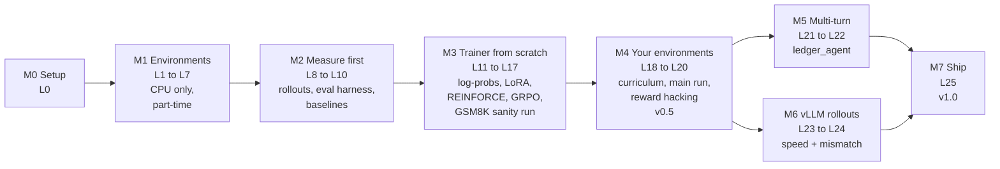
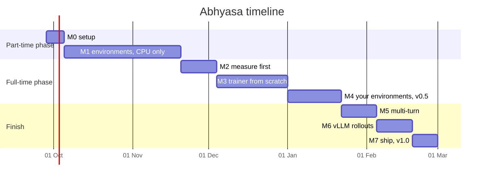

# Abhyasa: Build Plan

An RL post-training stack built from scratch, lesson by lesson. Named **Abhyasa** (Sanskrit
*abhyāsa*: practice, steady and long). The name is free on PyPI (checked 25 Sep 2026).

Companion document: [architecture.md](architecture.md) explains *what* is being built and *why*.
This file is the *order* in which it gets built.

---

## 1. Goal in one paragraph

Build every part of a modern RLVR pipeline yourself: verifiable environments for Indian
finance-operations tasks (with reference solvers, proved-unique answers and an attack catalog), a
GRPO trainer written from scratch in PyTorch (own LoRA, own memory-safe log-probs, own losses from
REINFORCE to DAPO), and an evaluation harness with dev/test splits, several seeds and confidence
intervals. Train Qwen2.5-0.5B-Instruct on a 6 GB laptop GPU and show, with honest statistics,
what it learned, what it learned to cheat at, and how the verifier was fixed. Finally, move rollouts to vLLM,
measure the training-inference mismatch that creates, and publish the environments on the Prime
Intellect Environments Hub.

## 2. What "done" looks like

### v0.5, presentable (after L19, target late January 2027)

| # | Criterion | How it is checked |
|---|---|---|
| 1 | gst_invoice and settlement_match pass the contract suite on 10,000 seeds per level | `pytest -m "not gpu"` |
| 2 | Every attack in the catalog scores 0, and the audit verifier is an independent implementation | `tests/test_redteam.py` |
| 3 | Trainer written from scratch (no TRL, verl, OpenRLHF, Unsloth, peft), with hand-computed unit tests for losses, advantages and LoRA | `tests/` |
| 4 | E1: GSM8K gain over our own baseline, test-set 95% CI excluding zero, with random-reward and format-only controls | `docs/experiments.md` |
| 5 | E2: settlement_match results by level and answer class, 3 seeds, CIs, GRPO vs Dr. GRPO vs DAPO-lite | `docs/experiments.md` |

### v1.0, complete (after L25, target early March 2027)

| # | Criterion | How it is checked |
|---|---|---|
| 6 | E4: time to exploit for three planted verifier bugs, plus every real hack found, with its fix | `docs/hacks.md` |
| 7 | E6: GSM8K and IFEval-subset scores before and after training | `docs/experiments.md` |
| 8 | ledger_agent environment with baselines for 0.5B, 1.5B and API models, plus a multi-turn training result (negative results count) | `docs/experiments.md` |
| 9 | vLLM as the rollout engine: output parity, step-time speedup, mismatch measurement, TIS on and off | `docs/numbers.md`, `docs/experiments.md` |
| 10 | Environments published on the Hub; README, blog post, demo video; CPU tests in GitHub Actions | review |

## 3. Ground rules for how we work

- **Understand, explain back, then type.** Each lesson starts with the concept. The *Explain back*
  questions below are answered in your own words before any code is written, and every line of
  code is typed by hand, then reviewed against the lesson's test.
- **Every lesson ends with a test or a number.** No lesson is finished on "it looks right".
- **Every environment has a solver, and every loss has a hand-computed test.** The slow, obvious
  version stays in the repo beside the fast one.
- **Read samples, not just curves.** No training result counts until you have read the completions
  behind it.
- **Write the experiment down before running it.** Hypothesis, comparison and metric go into
  `docs/experiments.md` first. Decisions use the dev set, and reported numbers use the test set.
- **Part-time until 19 November.** Until then, only the CPU lessons (L0 to L7), at about 8 to 10
  hours a week.
- **Lean code comments**; explanation lives in the docs.
- **Small commits**, at least one per lesson.

## 4. Fixed technical decisions (defaults, changeable)

| Decision | Choice | Why |
|---|---|---|
| OS and repo | WSL2 Ubuntu, repo at `~/abhyasa` (ext4, not `/mnt/c` or OneDrive) | vLLM and Triton need Linux; ext4 avoids OneDrive file locks |
| Python | 3.12 via `uv` | Widest PyTorch and vLLM wheel support |
| Model (laptop) | Qwen2.5-0.5B-Instruct, bf16 | Fits 6 GB with room for rollouts; published baselines; among the most studied small models in GRPO work |
| Model (Kaggle) | Qwen2.5-1.5B-Instruct, fp16 | T4 and P100 have no bf16 |
| Model code for training | Hugging Face `transformers` | Needs autograd and checkpointing; this project is about RL, not model code |
| Fast rollouts (M6) | vLLM, in the same process, with sleep mode | The rollout engine production RL frameworks use |
| RL code | All ours: no TRL, verl, OpenRLHF, Unsloth or peft | The point of the project |
| LoRA | Rank 16, α = 32, on all 7 linear maps of every layer | "LoRA Without Regret" findings (architecture.md 11) |
| Batch shape | P = 8 tasks × G = 8 completions = 64 per step | Dead-group arithmetic (architecture.md 15) |
| Max new tokens | 512 for single-turn tasks | Room for reasoning plus the answer |
| Algorithms | REINFORCE, then GRPO, Dr. GRPO, DAPO-lite as config flags | Controlled comparisons |
| Rewards | Binary by default | Hard to hack; partial credit only in E3 |
| Money | Integer paise | Exact arithmetic |
| Logging | JSONL + matplotlib; Weights & Biases optional | Works offline and on Kaggle |
| API calibration | Groq free tier through an OpenAI-compatible client, every response cached | Free; every probe spends real quota, so nothing is requested twice |
| Tests | pytest; GPU tests marked `@pytest.mark.gpu` | CPU subset runs in free CI |
| Compute | RTX 4050 6 GB laptop; Kaggle (30 GPU-hours a week) for 1.5B and long runs | What is available for free |

## 5. The roadmap at a glance

### Timeline

The dates assume about 8 to 10 hours a week until 19 November, then 15 to 20 hours a week.
Shift everything if either assumption changes. M5 and M6 are independent and can swap order.

That puts v0.5 around 22 January 2027 and v1.0 around 1 March 2027. L5, L19 and L21 are large
and will take several sittings.

---

## 6. Lessons

Format for each lesson: **Goal**, **You learn**, **You type**, **Explain back** (answered in
your own words before typing), **Done when**.

### M0 Setup

#### L0. Environment and first numbers
- **Goal:** a working repo in WSL, the model loading and sampling, and the first memory numbers.
- **You learn:** the repo layout (architecture.md 4), why RL samples at temperature 1.0, what sits
  in GPU memory while generating a batch.
- **You type:**
  - `git clone https://github.com/SakashSrivastava/abhyasa ~/abhyasa`, then `uv init --bare` inside
    it (it writes only `pyproject.toml`, so the committed README and `.gitignore` stay). Pin Python
    3.12 and install `torch`, `transformers`, `safetensors`, `numpy`, `pytest`, `matplotlib`,
    `pyyaml`. If WSL gets less than 12 GB of RAM, set `memory=12GB` in `%UserProfile%\.wslconfig`.
  - `scripts/hello_model.py`: load Qwen2.5-0.5B-Instruct in bf16, apply the chat template to one
    invoice-style prompt, sample 8 completions at T = 1.0, print tokens/s and peak memory.
  - `docs/numbers.md` with those numbers.
- **Explain back:** name every item in GPU memory during generation and roughly how big each is.
- **Done when:** numbers are in `docs/numbers.md`, committed and pushed from WSL.

### M1 Environments (CPU only, part-time phase)

#### L1. Policy gradients on a toy
- **Goal:** watch REINFORCE work before any LLM is involved. First a 10-armed bandit, then a
  "password" task: a tiny policy (one logit table per position) must emit an exact 5-token
  sequence, and only the exact sequence earns reward.
- **You learn:** the log-derivative trick, why a baseline keeps the gradient unbiased and cuts its
  variance, group baselines, sparse rewards, and why the password task never learns from scratch
  (random success is 1 in 100,000 with 10 tokens per position) but does learn with a curriculum
  (length 1, then 2, up to 5).
- **You type:** `toy/bandit.py`, `toy/password.py`, `toy/plot.py` (plain PyTorch on CPU).
- **Explain back:** derive ∇E[R] = E[R ∇log π] in three lines. Why does subtracting a baseline
  leave the expected gradient unchanged?
- **Done when:** a plot of learning curves (no baseline, mean baseline, group baseline) over 5
  seeds, a measured gradient-variance ratio, and the password task solved with a curriculum.

#### L2. The environment contract
- **Goal:** `Task`, `Score`, the `Env` protocol, a registry, and the contract test suite, exercised
  on a trivial "add two numbers" environment.
- **You learn:** interface design, pure functions, deriving seeds from hashes of
  (split, env, level, index), randomized property tests.
- **You type:** `abhyasa/envs/base.py`, `envs/contract.py`, `envs/toy_add.py`,
  `tests/test_contract_toy.py`.
- **Explain back:** why is the gold answer a *set*? What exactly does "the solver's answer scores
  1 on 10,000 seeds" prove?
- **Done when:** the toy environment passes the whole contract suite in under 5 seconds.

#### L3. Money and strict parsing
- **Goal:** exact paise arithmetic, and an answer parser that cannot be fooled.
- **You learn:** why floats fail for money, rounding modes (half up vs half even), Python's
  surprising leniency (`int("१२३")` is 123, `int("1_000")` is 1000, regex `\d` matches Devanagari
  digits), strict regexes, schema checks.
- **You type:** `envs/money.py` (rupee string to paise, paise to string, percentage with half-up
  rounding), `envs/parsing.py` (exactly one `<answer>` block, strict JSON, key and type checks),
  `tests/test_money.py`, `tests/test_parsing.py`.
- **Explain back:** why does the worked GST example total ₹625.35 inter-state but ₹625.36
  intra-state?
- **Done when:** the parsing attacks from architecture.md 9 all return parse errors, and the
  ₹625.35 / ₹625.36 example is a passing test.

#### L4. Env 1: gst_invoice
- **Goal:** generator, reference solver, verifier and prompt, levels L1 to L5.
- **You learn:** writing prompts for exact tasks (rules first, format last), difficulty knobs,
  the difference between rendering an answer and verifying one.
- **You type:** `envs/gst_invoice/{generator,solver,verifier,prompt}.py`,
  `tests/test_gst_invoice.py`.
- **Explain back:** which knob makes L3 harder than L2, and what mistake do you expect a 0.5B
  model to make there?
- **Done when:** the contract suite passes on 10,000 seeds per level, and three rendered tasks
  per level are in `docs/envs.md` and you have read them.

#### L5. Env 2: settlement_match (several sittings)
- **Goal:** the core environment: fee math, the search for gross values whose net matches, the
  subset-sum solver, proved uniqueness, the ambiguous and no-match classes, distractors, levels.
- **You learn:** why you never invert a function that is not one-to-one, brute force vs
  meet-in-the-middle, generating tasks with a *guaranteed* answer class, class balance as a hack
  defense.
- **You type:** `envs/settlement_match/{fees,solver,generator,verifier,prompt}.py`,
  `tests/test_settlement.py` (brute force and meet-in-the-middle agree on 2,000 random small cases;
  the ₹12,053.66 example; the INV-106 ambiguity example).
- **Explain back:** how can two different gross amounts give the same net? Why does "this set
  closes" not prove the answer is right?
- **Done when:** the contract suite passes; you reproduce the count of 44,840 colliding gross
  amounts between ₹1,000 and ₹20,000; answer-class shares per level match the design table within
  1 point over 10,000 seeds.

#### L6. Red team: attack catalog, audit verifier, planted bugs
- **Goal:** make the verifiers hard to fool, and build the instruments that detect fooling.
- **You learn:** adversarial thinking, independent re-implementation as a check, the hack-rate
  metric (audit disagreement).
- **You type:** `redteam/attacks.py` (every row of architecture.md 9, as functions that produce an
  attack output for any task), `redteam/audit.py` (a strict verifier for both environments, written
  *without* looking at the training verifier), the `vulnerable=True` switch with three planted
  bugs, `tests/test_redteam.py`.
- **Explain back:** why must the audit verifier be written separately rather than copied?
- **Done when:** every attack scores 0 on the real verifiers; the audit verifier catches each
  planted bug; the contract suite now runs the catalog.

#### L7. Calibrate with large models through free APIs
- **Goal:** prove the prompts are clear and the levels are correctly ordered, before any GPU time.
- **You learn:** strong models as prompt debuggers, quota discipline (every probe spends real
  quota), response caching keyed by a prompt hash.
- **You type:** `scripts/calibrate_api.py` (OpenAI-compatible client pointed at Groq, cached,
  30 tasks per level per environment), `docs/calibration.md`. Budget: about 300 calls. Groq's free
  tier allows about 200k tokens per model per day, so spread the calls across two models or two days.
- **Explain back:** if a 70B model fails L1 30 percent of the time, what do you change, and what
  do you *not* change?
- **Done when:** a pass-rate table by level for at least two API models; every L1 failure read and
  labelled (prompt bug or model error); prompt fixes committed.

### M2 Measure before you train

#### L8. Rollout engine v1: Hugging Face
- **Goal:** the `RolloutEngine` protocol and `HFEngine`: batched sampling of G completions per
  prompt, keeping the exact sampled token IDs.
- **You learn:** left padding and attention masks, stop tokens (`<|im_end|>`), why static batches
  waste time (measure the fraction of decode steps spent on sequences that already finished).
- **You type:** `rollout/engine.py`, `rollout/hf_engine.py`, `rollout/collector.py` (single-turn),
  `tests/test_hf_engine.py` (GPU).
- **Explain back:** why must the trainer compute log-probs on the *sampled* token IDs, never on a
  re-tokenized version of the text?
- **Done when:** 64 completions generate correctly; tokens/s, peak memory and the wasted-step
  fraction are in `docs/numbers.md`.

#### L9. Evaluation harness and statistics
- **Goal:** the measuring instrument: dev and test sets, greedy and sampled pass@1, pass@k,
  bootstrap CIs, paired comparisons.
- **You learn:** the unbiased pass@k estimator, the bootstrap, the paired bootstrap, McNemar's test,
  statistical power (how many tasks it takes to see a 5-point gain).
- **You type:** `eval/harness.py`, `eval/stats.py`, `tests/test_stats.py` (pass@k against brute-force
  enumeration; CI coverage on simulated data).
- **Explain back:** why is a paired comparison more sensitive than comparing two separate CIs?
- **Done when:** re-running an eval reproduces the greedy numbers exactly; your CI covers the true
  value 93 to 97 percent of the time in simulation; a power table is in `docs/`.

#### L10. Baselines for the 0.5B model
- **Goal:** know the starting line before training anything.
- **You learn:** failure taxonomies (parse error, wrong arithmetic, wrong subset, wrong answer
  class), choosing training levels from pass rates, reproducing a published number (Qwen reports
  49.6 on GSM8K for this model; yours will differ with your prompt, and you will explain why).
- **You type:** `scripts/baseline_eval.py`, `docs/baselines.md` (both environments, every level,
  greedy and sampled, with CIs; GSM8K; a failure taxonomy from 50 read samples).
- **Explain back:** using the dead-group table, which levels are trainable right now?
- **Done when:** the baselines table with CIs is committed, and the training levels are chosen and
  justified.

### M3 The trainer, from scratch

#### L11. Token log-probs, memory-safe
- **Goal:** `token_logprobs(model, input_ids, completion_mask)`: first the naive version, then the
  chunked and checkpointed one, plus token entropy.
- **You learn:** the shift by one, masks, why logits dominate memory (0.58 GiB per 1,024-token
  sequence in fp32), `torch.utils.checkpoint`, logsumexp.
- **You type:** `model/logprobs.py`, `tests/test_logprobs.py`, `scripts/memory_probe.py`.
- **Explain back:** which position's logits predict the first completion token?
- **Done when:** chunked equals naive within 1e-5 in fp32, for values and gradients; peak memory
  for a 4 × 1,024 batch is measured both ways.

#### L12. LoRA from scratch
- **Goal:** `LoRALinear`, injection into all 7 linear maps in all 24 layers, frozen base, merge and
  unmerge, save and load, and the reference mode (adapters off).
- **You learn:** low-rank updates, why B starts at zero, the α/r scaling, parameter counting, the
  free reference model.
- **You type:** `model/lora.py`, `model/policy.py`, `tests/test_lora.py`.
- **Explain back:** count the trainable parameters at rank 16 by hand *before* running any code.
- **Done when:** at init the LoRA model's output equals the base model's exactly; merged equals
  unmerged within tolerance; adapters-off equals the original; the count is 8,798,208.

#### L13. Machinery check: overfit a tiny batch
- **Goal:** before adding RL noise, prove that gradients, LoRA, the optimizer, checkpointing and
  memory all work: fine-tune on 32 reference-solver answers until the loss is near zero.
- **You learn:** the "overfit one batch" debugging habit, AdamW, warmup, gradient clipping,
  micro-batching and accumulation, checkpointing on vs off.
- **You type:** `scripts/overfit_check.py` (supervised loss = −mean log-prob of the target tokens,
  reusing `logprobs.py`).
- **Explain back:** which bugs would this catch that an RL run would hide?
- **Done when:** loss is below 0.05 on the 32 examples, and memory with and without checkpointing is
  recorded.

#### L14. REINFORCE for the LLM
- **Goal:** the first real RL loop (rollouts, rewards, group-mean advantage, loss, step) on the
  easiest level whose pass rate is between 10 and 90 percent.
- **You learn:** how the L1 toy maps onto an LLM, a sequence's log-prob as a sum of token log-probs,
  what the first 50 steps of a healthy run look like.
- **You type:** `algo/advantages.py`, `algo/losses.py` (REINFORCE), `algo/step.py`, `train.py` v0.
- **Explain back:** what happens to the gradient when all 8 samples of a task are correct?
- **Done when:** reward on the training level rises over about 100 steps in 2 of 3 seeds with no
  NaNs, and you have read 20 samples from the start and 20 from the end.

#### L15. GRPO proper
- **Goal:** std-normalized advantages, PPO's clipped ratio with μ inner epochs, cached old
  log-probs, k3 KL against the adapters-off reference, and the three loss aggregations (GRPO,
  Dr. GRPO, token-level).
- **You learn:** trust regions, importance ratios, the k3 estimator, the two Dr. GRPO biases, why
  μ = 1 makes the ratio exactly 1.
- **You type:** the rest of `algo/losses.py` and `algo/advantages.py`, `tests/test_losses.py`
  (hand-computed tiny examples for every mode, including ratio = 1 at the first inner step and zero
  loss for dead groups).
- **Explain back:** on a two-completion example, show how dividing by the completion length makes
  long wrong answers cheaper.
- **Done when:** every hand-computed test passes, and one GRPO run on the L14 setting matches or
  beats REINFORCE on the dev set.

#### L16. Training-loop engineering
- **Goal:** turn the script into an instrument: configs, every metric in architecture.md 14, sample
  dumps, checkpoint and resume, the step-time breakdown, a learning-rate sweep.
- **You learn:** reproducibility (seeding everything, and what GPU nondeterminism still breaks),
  what a checkpoint must contain, verifying a resume.
- **You type:** `config.py`, `logging.py`, `train.py` v1, `scripts/plot_run.py`, `configs/*.yaml`.
- **Explain back:** what must a checkpoint contain so a resumed run continues the *same* run?
- **Done when:** a run killed at step 50 and resumed continues within noise; the rollout / verify /
  train split is in `docs/numbers.md`; the learning rate is chosen from a sweep on dev.

#### L17. Sanity experiment on GSM8K (E1)
- **Goal:** prove the trainer works on a public task with a known starting point, before trusting
  it on your own environments.
- **You learn:** controls (random reward, format-only reward), why "the reward went up" is not
  evidence, separating format gains from skill gains.
- **You type:** `envs/gsm8k.py` (answer extraction and verifier, passing the contract tests that
  apply), `configs/e1_*.yaml`.
- **Explain back:** if the random-reward run also improves, what does that say about the real run?
- **Done when:** the E1 table in `docs/experiments.md`: baseline, GRPO, random reward and format-only,
  3 seeds each, test-set CIs, with the format-valid rate shown separately.

### M4 Train on your own environments

#### L18. Curriculum and DAPO pieces
- **Goal:** the p(1 − p) level sampler, dynamic sampling (drop dead groups, refill), clip-higher,
  overlong masking.
- **You learn:** why the sampler weights levels by the reward's variance, how dynamic sampling
  changes the effective batch, entropy collapse and how clip-higher fights it.
- **You type:** `envs/curriculum.py`, the DAPO options in `algo/`, tests (the sampler converges on
  simulated pass rates).
- **Explain back:** at p = 0.05 and G = 8, what fraction of groups is dead, and what are your two
  options?
- **Done when:** on gst_invoice the dead-group fraction falls versus L16 at equal compute, and a small
  on/off ablation table for each piece is on dev.

#### L19. Main run: settlement_match (E2, several sittings)
- **Goal:** the headline result.
- **You learn:** running a real study: pre-registration, three seeds, comparing GRPO, Dr. GRPO and
  DAPO-lite, per-level and per-class analysis, regression checks (E6).
- **You type:** `configs/e2_*.yaml`, `scripts/analyze_e2.py`, the results in `docs/experiments.md`.
- **Explain back:** which of your results would survive if the test set were redrawn with new
  seeds, and how do you know?
- **Done when:** a test-set table by level and answer class, 3 seeds per variant with CIs, and GSM8K
  and IFEval-subset scores before and after. **This is v0.5: a complete, presentable project.**

#### L20. Reward-hacking experiments (E3, E4)
- **Goal:** partial vs binary reward on gst_invoice; training on the vulnerable verifier to measure
  time to exploit for each planted bug; mining real, unplanted hacks from the samples.
- **You learn:** specification gaming in practice, audit disagreement as a live metric, fixing a
  verifier without invalidating earlier results.
- **You type:** `configs/e3_*.yaml`, `configs/e4_*.yaml`, `docs/hacks.md` (for each hack: a sample,
  the mechanism, the fix, the rerun).
- **Explain back:** why did the policy find one planted bug before another?
- **Done when:** a time-to-exploit table for the three planted bugs, and every real hack found is
  documented with its fix.

### M5 Multi-turn tool use

#### L21. Env 3: ledger_agent (several sittings)
- **Goal:** the sandbox, the tools, Qwen tool-call parsing, the episode loop, the final-state
  verifier, multi-turn contract tests and API-model calibration.
- **You learn:** stateful environments, tool schemas, the re-tokenization trap, outcome checks vs
  process checks.
- **You type:** `envs/ledger_agent/{sandbox,tools,env,verifier}.py`, the multi-turn collector in
  `rollout/collector.py` (token-ID segments plus a loss mask), tests.
- **Explain back:** in a three-turn episode, which tokens get a loss-mask value of 1?
- **Done when:** the contract suite passes; a test proves the collector's token IDs equal the
  sampled IDs exactly; baselines for 0.5B, 1.5B (Kaggle) and two API models, by level.

#### L22. Multi-turn RL (E8)
- **Goal:** train on ledger_agent: 0.5B locally on the easiest levels, 1.5B on Kaggle in fp16.
- **You learn:** credit assignment across turns, turn and token budgets, fp16 overflow on T4s,
  running long jobs on Kaggle with resume.
- **You type:** `configs/e8_*.yaml`, a Kaggle notebook wrapper, the fp16 path.
- **Explain back:** why is one reward per trajectory harder to learn from than one per answer?
- **Done when:** a result with CIs, even a negative one, written up honestly in
  `docs/experiments.md`.

### M6 vLLM as the rollout engine

#### L23. VLLMEngine and weight sync
- **Goal:** vLLM running in the training process behind `RolloutEngine`: sleep during the training
  phase, wake for rollouts, push merged LoRA weights, reset the prefix cache (architecture.md 18).
- **You learn:** colocated training and inference, splitting 6 GB between two systems
  (`gpu_memory_utilization`, sleep levels), weight-sync design (merged weights vs vLLM's native
  LoRA path), the stale-cache bug, why prefix caching suits GRPO groups.
- **You type:** `rollout/vllm_engine.py`, `tests/test_vllm_parity.py`.
- **Explain back:** what goes wrong if you forget `reset_prefix_cache()` after a weight update?
- **Done when:** with the same weights, both engines give matching greedy output (at a stated
  tolerance); peak memory with and without sleep mode and step time before and after are in
  `docs/numbers.md`.

#### L24. Training-inference mismatch and TIS (E7)
- **Goal:** measure how far vLLM's log-probs are from the trainer's, correct for it with TIS, and
  compare bf16 with fp16.
- **You learn:** off-policy correction, truncated importance weights, numerical precision as an RL
  problem.
- **You type:** TIS in `algo/losses.py`, `scripts/mismatch.py`.
- **Explain back:** why can two correct implementations of the same model give different log-probs?
- **Done when:** a mismatch histogram for bf16 and fp16, training curves with TIS on and off, and a
  rollout speedup table with CIs.

### M7 Ship

#### L25. Publish and write up
- **Goal:** make the work usable by others and readable by a hiring manager in two minutes.
- **You type:**
  - `integrations/verifiers/` adapters (re-check the verifiers API that day), a `uv run eval`
    against a model, `prime env push`, and a check of open bounties.
  - `README.md`: results tables, the architecture diagram, "what broke and how I fixed it",
    honest limitations.
  - `docs/blog.md`: "What my verifier taught my model to cheat at".
  - `.github/workflows/ci.yml` (CPU tests), and a demo video under 5 minutes.
- **Done when:** every v1.0 criterion in section 2 is ticked.

---

## 7. Experiments register

Each experiment is written up in `docs/experiments.md` *before* it runs.

| ID | Question | Comparison | Primary metric | Lesson |
|---|---|---|---|---|
| E0 | Are the levels well ordered and the prompts clear? | 0.5B, 1.5B, two API models | pass rate by level | L7, L10 |
| E1 | Does the trainer work at all? | baseline, GRPO, random reward, format-only (3 seeds) | GSM8K test pass@1 | L17 |
| E2 | What does RL buy on settlement_match? | GRPO, Dr. GRPO, DAPO-lite (3 seeds) | test pass@1 by level and class | L19 |
| E3 | Does partial credit help or get hacked? | binary vs partial reward on gst_invoice | test pass@1, audit disagreement | L20 |
| E4 | How fast does RL find verifier bugs? | vulnerable vs fixed verifier | steps to 10% audit disagreement, per bug | L20 |
| E5 | What does the KL penalty do? (optional) | β = 0, 0.01, 0.04 | reward, entropy, GSM8K retention | L19 |
| E6 | What did specialization cost? | before vs after | GSM8K, IFEval subset | L19 |
| E7 | Does the rollout engine change the learning? | HF vs vLLM rollouts, TIS on and off, bf16 vs fp16 | mismatch, reward curves, step time | L24 |
| E8 | Can a small model learn multi-turn tool use? | 0.5B local, 1.5B Kaggle | test pass@1 by level | L22 |

## 8. Risks and how we handle them

| Risk | Mitigation |
|---|---|
| The 0.5B model does not learn settlement_match | Calibration picks levels with pass rates between 10 and 90 percent; the curriculum; 1.5B on Kaggle; a clean negative result with controls is still a result |
| Gains are only format fixes | Format-valid rate reported separately from accuracy given a valid format; a format-only control run |
| Noise swamps the effects | 3 seeds, paired tests, the dev/test split, pre-registration |
| Reward hacking corrupts a result | The audit verifier runs live; samples are read every N steps |
| Rollouts are too slow on the laptop | Measured in L8 and L16; smaller P or G; Kaggle; M6 exists for exactly this |
| Out of GPU memory | Chunked log-probs, checkpointing, micro-batching; the L11 memory probe |
| T4s have no bf16 | fp16 path with overflow checks (L22) |
| vLLM does not install, or does not fit beside the trainer in 6 GB | Sleep mode, a small `gpu_memory_utilization`, `enforce_eager`; the HF engine stays the default; M6 can run on Kaggle |
| The verifiers API changes again | The adapter is isolated and built last |
| Groq quota runs out | Cached responses, 30 tasks per level, calls spread across models and days |
| Limited hours until 19 November | Only CPU lessons in that phase, time-boxed to 8 to 10 hours a week |
| "RL on small models has been done" | The differentiators are our own environments with proved uniqueness, the reward-hacking study, controls and CIs, and a measured training-inference mismatch study |

## 9. Progress tracker

| Lesson | Status | Commit | Key number |
|---|---|---|---|
| L0 Environment + first numbers | ⬜ | | |
| L1 Policy gradients on a toy | ⬜ | | |
| L2 Environment contract | ⬜ | | |
| L3 Money + strict parsing | ⬜ | | |
| L4 gst_invoice | ⬜ | | |
| L5 settlement_match | ⬜ | | |
| L6 Red team + audit verifier | ⬜ | | |
| L7 API calibration | ⬜ | | |
| L8 HF rollout engine | ⬜ | | |
| L9 Eval harness + statistics | ⬜ | | |
| L10 0.5B baselines | ⬜ | | |
| L11 Memory-safe log-probs | ⬜ | | |
| L12 LoRA from scratch | ⬜ | | |
| L13 Overfit check | ⬜ | | |
| L14 REINFORCE | ⬜ | | |
| L15 GRPO | ⬜ | | |
| L16 Training-loop engineering | ⬜ | | |
| L17 GSM8K sanity (E1) | ⬜ | | |
| L18 Curriculum + DAPO | ⬜ | | |
| L19 Main run (E2), v0.5 | ⬜ | | |
| L20 Reward hacking (E3, E4) | ⬜ | | |
| L21 ledger_agent | ⬜ | | |
| L22 Multi-turn RL (E8) | ⬜ | | |
| L23 vLLM engine + weight sync | ⬜ | | |
| L24 Mismatch + TIS (E7) | ⬜ | | |
| L25 Publish + write-up, v1.0 | ⬜ | | |

## 10. First steps

1. ✅ Create the GitHub repo and commit the design documents, README, license and authors list.
2. L0: clone the repo into `~/abhyasa` in WSL and set up the environment.
3. L1: start with the policy-gradient derivation, on paper, before any code.
